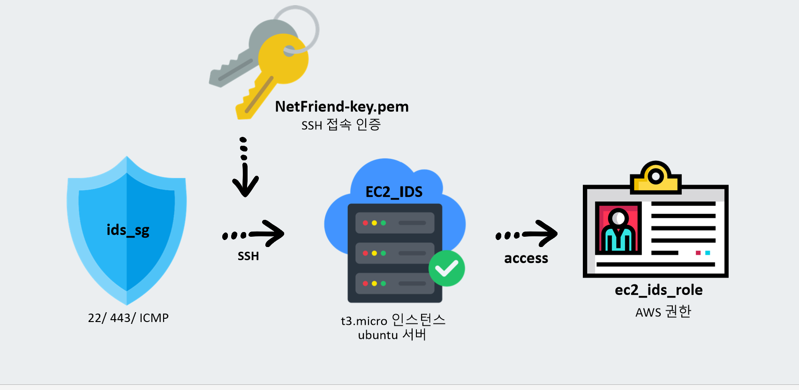
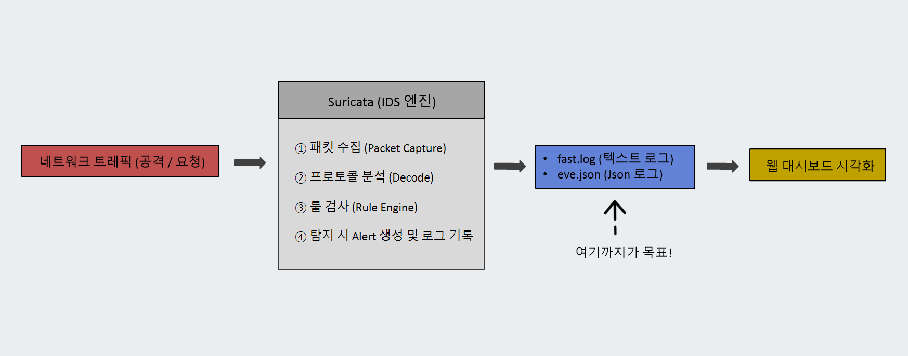

# EC2_IDS  
EC2 Security Server & Suricata IDS Setup

이 폴더는 **AWS EC2 기반 보안 서버를 구축하고 Suricata IDS를 설치·테스트한 과정**을 정리한 폴더입니다.  
네트워크 트래픽이 IDS를 거쳐 **로그(eve.json / fast.log)로 생성되고, 이후 웹 대시보드로 연동되는 흐름의 시작 지점**입니다.

---

## 🗺️ EC2 보안 서버 구성도

- EC2 인스턴스(t3.micro, Ubuntu) 기반 보안 서버
- 보안 그룹(ids_sg)을 통해 22 / 443 / ICMP 허용
- SSH Key Pair를 이용한 안전한 접속
- IAM Role(ec2_ids_role)을 통해 AWS 리소스 접근 권한 부여

---

## ⚙️ IDS 동작 알고리즘 (Suricata)

네트워크 트래픽이 유입되었을 때 Suricata IDS 내부 동작 흐름은 다음과 같습니다.

- 네트워크 트래픽 수신 (공격 / 정상 요청)
- 패킷 캡처(Packet Capture)
- 프로토콜 분석(Decode)
- 룰 엔진(Rule Engine)을 통한 검사
- 탐지 시 Alert 생성
- fast.log, eve.json 로그 파일 생성
- 이후 단계에서 웹 대시보드로 시각화 연동

이 단계까지가 **EC2_IDS 폴더의 구현 목표**입니다.

---

## 📌 구성 내용

### 1. EC2 보안 서버 초기 설정
- EC2 인스턴스 생성 및 Ubuntu 서버 구성
- 보안 그룹 및 키 페어 생성
- IAM Role 생성 및 권한 연결
- 기본 패키지 및 네트워크 환경 설정

---

### 2. Suricata IDS 설치
- Suricata 패키지 설치 및 서비스 활성화
- 네트워크 인터페이스 설정
- HOME_NET 정의 및 기본 탐지 환경 구성
- Suricata 서비스 권한(cap_net_raw) 설정

---

### 3. 테스트용 룰 구성
- local.rules 기반 테스트 룰 작성
- 특정 포트 / 패킷 접근 시 Alert 발생
- 실제 운영용 룰이 아닌 **검증 목적의 최소 룰셋** 사용

---

### 4. IDS 동작 검증
- fast.log / eve.json 이벤트 생성 확인
- hping3 등을 활용한 패킷 전송 테스트
- 공격 트래픽 → 탐지 → 로그 생성 흐름 검증

---

## 📄 문서 목록
- EC2 보안 서버 초기 설정 문서
- Suricata IDS 설치 및 설정 문서
- 테스트 룰 구성 및 동작 검증 문서

---

## 참고
- 본 폴더는 **IDS 탐지 및 로그 생성 단계까지를 검증**하기 위한 구성입니다.
- 실제 차단(IPS), 로그인 보안, ipset 연동은  
  internal_security 폴더에서 다룹니다.
- 생성된 eve.json 로그는  
  이후 server-monitor 대시보드로 연동됩니다.
