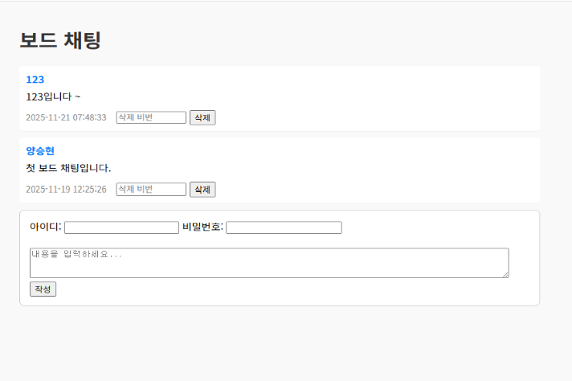

# Hybrid Server  
On-Premise × AWS Cloud Integration

이 폴더는 물리 서버(VM)와 AWS EC2를 연동하여 하이브리드 서버 환경을 구성하고, Auto Scaling 상태에 따라 트래픽을 동적으로 제어하는 구조를 구현한 과정을 
정리한 폴더입니다.

VPN 기반 네트워크 연동부터 물리 서버 서비스 운영, 클라우드 확장, 트래픽 제어 로직까지 하이브리드 환경에서의 실제 운영 시나리오를 포함합니다.

---

## 🗺️ 하이브리드 서버 전체 구성도

---

## 구성 내용

### 1. VPN 연결 구성
- StrongSwan 기반 Site-to-Site VPN 구축  
- 물리 서버 ↔ AWS VPC 간 암호화된 통신  
- 내부망 접근 및 서비스 연동 테스트  

---

### 2. 물리 서버 구성
- 온프레미스 물리 서버(VM) 환경 구축  
- CloudWatch Agent 설치 및 메트릭 전송 설정  
- CPU/메모리 지표 수집  
- 내부 서비스 및 DB 통신 환경 구성  

---

### 3. EC2 서비스 환경 구축
- EC2 보안 서버 초기 세팅  
- FastAPI / React 기반 서비스 배포  
- Nginx Reverse Proxy 설정  
- 물리 서버와 EC2 간 연동 구조 구성  

---

### 4. Auto Scaling & Load Balancer 구성
- Launch Template 작성  
- CPU 기반 Auto Scaling 정책 적용  
- Application Load Balancer 트래픽 분산  
- 서버 복제 및 확장 테스트  

---

### 5. Hybrid Auto Scaling 연동  
(Lambda 기반 트래픽 제어)

- EventBridge를 통해 Auto Scaling 이벤트 감지  
- 실행 중인 EC2 인스턴스 수에 따라 트래픽 흐름 자동 제어  

동작 방식  
- EC2 인스턴스 존재  
  → AWS EC2 ↔ 물리 서버 트래픽 50 : 50 분산 (Hybrid 모드)  
- EC2 인스턴스 모두 종료  
  → 트래픽을 물리 서버(On-Premise)로 100% 전환  

- 특정 Auto Scaling Group만 처리하도록 필터링 로직 적용  
- 클라우드 축소 또는 장애 상황에서도 서비스 연속성 유지  

---

## 🖥️ On-Premise Physical Server System

- 온프레미스 환경에서 웹 서비스 운영  
- 내부 사용자용 게시판 및 채팅 시스템 실행  
- VPN을 통해 AWS 환경에서도 동일하게 접근 가능  
- 클라우드 장애 또는 축소 시에도 물리 서버 단독으로 서비스 지속 가능  

---

## 문서 목록
- VPN 구성 문서  
- 물리 서버 구성 문서  
- EC2 서비스 구축 문서  
- Auto Scaling & Load Balancer 구성 문서  
- Hybrid Auto Scaling Lambda 구성 문서  

---

## 참고
Auto Scaling 상태에 따라 트래픽을 자동으로 제어하는  Lambda 함수 코드는  `Hybrid_server/lambda` 디렉터리에 포함되어 있습니다.
