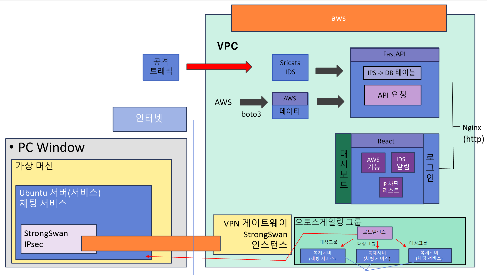

# 🔰 NetFriend  
**Real-time web monitoring system using hybrid cloud**  
하이브리드 클라우드를 이용한 실시간 웹 모니터링 시스템

[](https://github.com/sh456783/NetFriend/commits)


[](LICENSE)

---

## 📌 프로젝트 개요

**NetFriend**는  
온프레미스 물리 서버(On-Premise)와 AWS EC2 환경을 **VPN으로 연결한 하이브리드 구조**에서  
침입 탐지(IDS) → 자동 대응(IPS) → 서버 모니터링 → 시각화를  
**하나의 흐름으로 통합 구현한 보안·모니터링 시스템**입니다.

보안 탐지와 대응이 각각 분리되어 있는 기존 구조의 한계를 보완하기 위해  
다음과 같은 목표로 프로젝트를 설계·구현했습니다.

• 하이브리드 환경에서도 일관된 보안 탐지 및 대응  
• 침입 탐지 이후 자동 IP 차단까지 이어지는 실시간 대응  
• 서버 상태 · 보안 이벤트 · 차단 현황을 웹 대시보드에서 통합 관리  
• Auto Scaling 환경에서도 보안과 모니터링이 자동 확장되는 구조  

---

## 🎯 구현 목표

• Suricata 기반 실시간 침입 탐지 (IDS)  
• ipset 기반 고속 IP 차단 (IPS)  
• Fail2Ban 개선 방식의 로그인 공격 대응  
• 온프레미스 + AWS EC2 통합 서버 모니터링  
• FastAPI + React 기반 웹 대시보드 구현  
• Auto Scaling 환경에서도 동일하게 동작하는 보안 구조  

---

## 🗺️ 시스템 구성도

### 전체 아키텍처


---

## ⚙️ 주요 구현 내용

### 1️. 침입 탐지 시스템 (IDS – Suricata)

- AWS EC2 보안 서버에 **Suricata IDS 설치**
- 패킷 단위 실시간 트래픽 분석
- `eve.json`, `fast.log` 기반 이벤트 생성
- SSH / HTTP / ICMP 등 주요 공격 유형 탐지
- Custom Rule을 통한 탐지 조건 직접 정의

---

### 2️. 동적 대응 시스템 (IPS)

- Suricata 탐지 이벤트 중 **위험도 높은 이벤트 자동 선별**
- ipset을 활용한 **즉시 IP 차단**
- 차단된 IP는 DB에 저장되어 관리

---

### 3️. Fail2Ban 개선 보안 구조 (Internal Security)

- 로그인 실패 횟수 기반 공격 탐지
- 기존 Fail2Ban 구조를 개선하여:
  - 탐지 → 차단까지 소요 시간 단축
  - ipset 기반 차단으로 처리 속도 개선
- **기존 Fail2Ban vs Custom Fail2Ban 속도 비교 영상 제공**

---

### 4️. 하이브리드 서버 구성 (On-Premise × AWS)

- 물리 서버 ↔ AWS VPC 간 **Site-to-Site VPN (StrongSwan IKEv2)**
- 온프레미스 서버에 **CloudWatch Agent 설치**
- 물리 서버 CPU 지표를 AWS CloudWatch로 전송
- AWS EC2에서 물리 서버 상태를 **클라우드 서버와 동일하게 모니터링**

---

### 5️. Auto Scaling & Load Balancer

- Launch Template 기반 Auto Scaling Group 구성
- 트래픽 증가 시 서버 자동 확장
- 확장된 인스턴스도:
  - IDS
  - 모니터링
  - 대시보드 연동
  자동 포함

---

### 6️. 웹 대시보드 (FastAPI × React)

**실제 구현 완료된 대시보드 기능**

- EC2 인스턴스 상태 조회 / Start / Stop
- Auto Scaling 인스턴스 목록 자동 반영
- CloudWatch CPU 그래프 (EC2 + 물리 서버)
- Suricata IDS 이벤트 실시간 표시
- 시스템 로그(Base64 → Text 변환) 출력
- 자동/수동 IP 차단 리스트 관리
- 로그인 기반 접근 제어

## 👥 팀원 역할

| 이름 | 담당 역할 |
|------|-----------|
| **엄세현** | Auto Scaling, Load Balancer 구성, CloudWatch 연동 |
| **박혜소** | EC2 보안 서버 구축, Suricata IDS 설치, 웹 대시보드 배포(Nginx), IDS·AWS 연동 |
| **이주영** | React / FastAPI 기반 웹 대시보드 구현, 로그·메트릭 시각화 |
| **안준상** | IPS 자동 차단 로직, IP 차단 대시보드 구현, Fail2Ban 개선 |
| **양승현** | 하이브리드 아키텍처 설계, VPN(StrongSwan) 구축 |


## 📄 문서 & 자료 (Documentation)

NetFriend 프로젝트의 구체적인 구현 과정은 기능별 폴더에 구체적으로 정리해두었습니다.

---

IDS 설치 및 테스트

• EC2 환경에서 보안 서버 구축  
• Suricata IDS 설치 및 기본 설정  
• 테스트용 룰을 이용한 침입 탐지 동작 검증  
• 공격 트래픽 발생 시 탐지 이벤트 및 eve.json 로그 생성 흐름 정리  

---

하이브리드 서버 구성 (VPN)

• 온프레미스 서버와 AWS를 연동한 하이브리드 아키텍처 설계  
• StrongSwan 기반 Site-to-Site VPN 구성  
• 암호화된 터널을 통한 내부 네트워크 통신 구조 설명  

---

내부 보안 구조 (IDS / IPS)

• Suricata 탐지 이벤트 기반 IPS 자동 차단 로직 구현  
• ipset을 활용한 고속 IP 차단 처리  
• 기존 Fail2Ban과 커스텀 차단 로직의 차단 속도 비교  

---

CloudWatch & Auto Scaling

• EC2 및 물리 서버에 CloudWatch Agent 설치  
• CPU 메트릭 수집 및 CloudWatch 전송 구조  
• Auto Scaling 정책과 Load Balancer 연동 흐름 정리  
• 서버 확장 및 축소 시 서비스 흐름 설명  

---

웹 대시보드

• FastAPI + React 기반 서버 모니터링 대시보드 구현  
• IDS 로그 및 CloudWatch 메트릭 시각화  
• EC2 인스턴스 제어 및 IP 차단 목록 관리 기능  

---

시연 자료

• 공격 탐지 및 자동 차단 동작 시연 영상  
• IDS 탐지 → 로그 생성 → 차단 처리 전체 흐름 확인 가능  

---

각 기능에 대한 상세 내용은  
해당 폴더 내 README.md 및 PDF 문서를 참고하면 됩니다.


## 📂 디렉터리 구조

```text
NetFriend/
├── EC2_IDS/               # EC2 보안 서버 및 Suricata IDS 구성
├── hybrid_server/         # VPN, 하이브리드 서버, Auto Scaling 구성
├── internal_security/     # Fail2Ban 개선 IPS 보안 로직
├── server-monitor/        # FastAPI + React 웹 대시보드
├── Screenshots/           # 시스템 구성도 및 대시보드 & 물리서버 시스템 이미지
└── README.md              # 메인 프로젝트 설명
